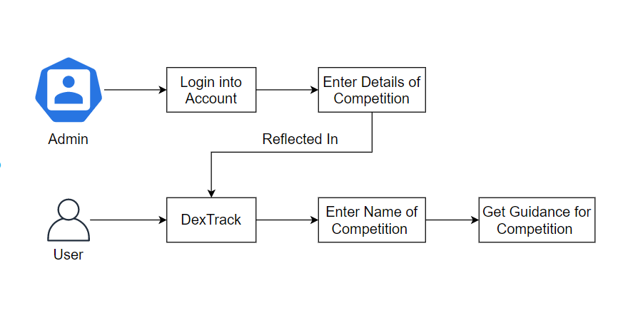

# DexTrack-An-Opportunity-Guidance-Track
DexTrack is my internship Capstone for <a href="https://www.dexterityglobal.org/">The Dexterity Global Group</a>. <a href="https://www.dexconnect.org/">DexConnect</a> is a opportunity discovery platform and it gives updates on every month but there are several opportunities like some of the competitions and scholarship opportunities which are held on each year at the same time like Hackathon competition, it is one of the technical competition which held on every year at near about same time and many of students participates in it. But some students can not get proper advantage of it because of getting information late. During delay in information gathering, they are not able to prepare well and not able to win the competition. There are several other competitions as well like Hackathon that held every year and having fix planning for competition. So, for this type of competition, I want to design one opportunity guidance track which helps students to figure out their skills and course guidance to win the competition. This track gives information about competition and related courses that helps them to prepare themselves for better performance in competition.

With the help of DexTrack many of the students get proper guidance for their competitions. This Track is also helpful for the students who want to prepare themselves for some scholarship Test, using this track they gather proper information that how to prepare and what courses to be follow to get desire output.

System consist two modules:

1.DexTrack (Common for every user – Access by Everyone)

2.Admin Panel (Only Access by Amin – Employs at Dexterity Global)

1.DexTrack:
--------------
This Track can be used for Opportunity Guidance, User can enter name of competition and get the detailed information about competition which will help them for preparation.

2.Admin Panel:
----------------
This module can be only handled by admin who is able to include new opportunity and details of it. Admin is able to add new data into system like competition name, required skills, suggested courses, approximate duration of competition on which competition is held. When admin add new opportunity, it will be directly reflected in DexTrack module which will be used by every user.

  

To create our better career, opportunities are really very important but it is beneficial, if we utilize it in well manner with proper planning and for that, guidance are required. In DexConnect, I create one more platform called DexTrack which helps individuals to get track/ guidance for the opportunity, well in advance. So that they prepare well and get benefits of opportunities with given suggested courses and skills.

<h4>Demonstration: https://drive.google.com/file/d/16SCp2IKn1yw-fZqd88WLq20LGo-Xh2t1/view?usp=sharing </h4>

Files Introduction:
-------------------
DexTrack/include/config.php: used to connect with database

Database file: DexTrack/include/Dexterity.sql

For images, js, css & bootstrap files refer zip files.

<h4>Files for Admin Module:</h4>

DexTrack/index.php: login page of Admin

DexTrack/add-track.php: to add new information for DexTrack

DexTrack/include/adminheader.php: used to create header of admin module

Dextrack/include/checklogin.php: on enter of admin module, it checks user is logged in or not, if not it navigates to index.php

<h4>Files for DexTrack:</h4>

DexTrack/track-search.php: usd to search for opportunity guidance

DexTrack/include/trackheader.php: used for DexTrack header
